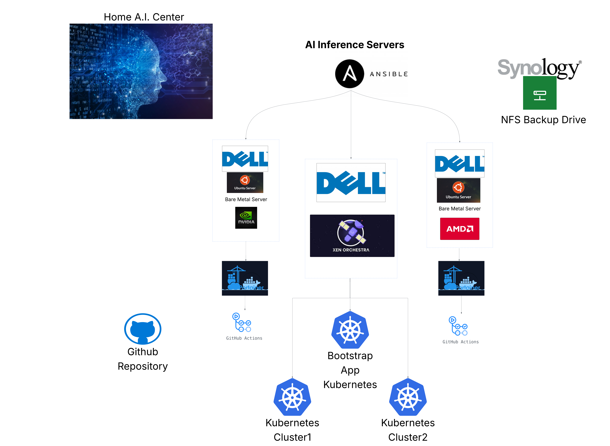

# 🧠 AI Data Center - On‑Prem Platform for Cloud‑Style AI


# Run Modern AI the Way Cloud Teams Do - On Your Hardware

Run modern AI the same way cloud engineering teams do — but entirely on your own infrastructure. This repository provides everything you need to bootstrap, automate, and operate a full on-prem AI stack with Kubernetes, model servers, and CI/CD integration. The **control plane templates** in [`virtualization-automation-hub/`](virtualization-automation-hub/) define host, VM, and cluster patterns, forming the blueprint for scalable and reproducible environments. The **K3s bootstrap script** in [`virtualization-automation-hub/bootstrap/`](virtualization-automation-hub/bootstrap/) deploys and validates a Kubernetes control plane with a single command. Once deployed, the **inference servers** in [`inference-servers/`](inference-servers/) provide Helm charts and manifests for **vLLM** and **NVIDIA Triton**, enabling efficient model inference directly on your hardware. Supporting automation comes from **CI runners** in [`inference-servers/ai-ml-github-runners/`](inference-servers/ai-ml-github-runners/) — optimized for AI/ML workflows — and a **model cache** in [`inference-servers/ai-ml-github-runners/ai-model-registry-cache/`](inference-servers/ai-ml-github-runners/ai-model-registry-cache/), which maintains synchronized model registries for low-latency, offline-ready inference. For a concrete example of how applications leverage this infrastructure, see **OpenLaw AI** at [https://github.com/jitter-ai/openlaw-ai](https://github.com/jitter-ai/openlaw-ai).




---

## 🚀 What You Get

* **A ready‑to‑run Kubernetes cluster (K3s)** on your machine or VM—no deep k8s background required.
* **A clear path to serve AI models** (vLLM or Triton) as scalable endpoints.
* **Cloud mapping** so your skills and workloads translate cleanly to AWS/Azure/GCP.

> Start tiny on a single box. Add GPUs and storage when you’re ready.


---

## 💡 Why This Pattern Works

* **Predictable cost (TCO):** Own your GPUs and storage, avoid per‑request/egress surprises, and place artifacts near compute.
* **Speed to value:** Git‑driven changes applied in minutes—from “idea” to “running service” fast.
* **Governance & auditability:** Version everything in Git; changes are reviewable, reversible, and reproducible.
* **Portability:** The pieces line up with cloud equivalents—burst to cloud or migrate when it makes sense.

---

## 🗺️ How It Maps to the Cloud

| This Project (On‑Prem)     | Cloud Analogue                                  | What It’s For                                   |
| -------------------------- | ----------------------------------------------- | ----------------------------------------------- |
| Kubernetes (K3s)           | Amazon **EKS** / Azure **AKS** / Google **GKE** | Orchestrating containers, scaling, self‑healing |
| vLLM / NVIDIA Triton       | **SageMaker Endpoints**                         | Serving models behind stable endpoints          |
| Harbor                     | **ECR**                                         | Container image registry                        |
| DevPI                      | **CodeArtifact**                                | Internal Python package repo                    |
| MinIO                      | **S3**                                          | Object storage for models/data                  |
| Git + Helm/kubectl scripts | **GitOps**                                      | Declarative deployments managed from Git        |

---

## 🧩 What is GitOps (and why it helps here)?

**GitOps** means your desired state (clusters, apps, policies) is declared in **Git** and applied to your environments. The **benefits**:

* **Single source of truth:** Git history = audit trail. You see *who* changed *what*, *when*, and *why*.
* **Reproducibility:** Any environment can be recreated from the same commits.
* **Faster, safer changes:** Small, reviewable PRs replace ad‑hoc edits on servers.
* **Easy rollbacks:** Revert a commit, not a server.

This repository follows that philosophy. For the Git layout, conventions, and examples, see the **project GitHub page** (root of this repo).

---

## 🏗️ Architecture at a Glance

1. **Control Plane** — where clusters and policy live

* Use **XCP‑ng + Xen Orchestra** (or your preferred hypervisor) to create VMs.
* A lightweight **K3s** cluster provides Kubernetes without heavy setup.
* Desired state is versioned in **Git** and applied via **Helm/kubectl**.

2. **Inference Workloads** — turn models into endpoints

* Deploy **vLLM** or **NVIDIA Triton** to GPU nodes.
* Kubernetes schedules, restarts, and scales pods automatically.


---

## ⏱️ Bootstrap in ~1 Command (Start Small)

> **Goal:** bring up a single‑node Kubernetes cluster on a Linux machine/VM. The bootstrap handles provisioning and verification.

### Prerequisites

* A Linux host or VM (x86_64).
* Python 3.9+ and `curl`.
* **Optional:** NVIDIA GPU + drivers (only needed to serve GPU models).

### Run the bootstrap

```bash
cd virtualization-automation-hub/bootstrap
sudo python3 bootstrap_cluster.py
```

That’s it—the script installs K3s, fixes `/etc/hosts`, configures kubeconfig for your user, and verifies the node is **Ready**.

---

## 📦 Deploy Your First Model Endpoint (scripted)

* Open **[`inference-servers/`](inference-servers/)** and choose **vLLM** or **Triton**.
* Fill in example values (model name/path).
* Apply with `helm upgrade --install ...` using your chosen chart/manifests.

> Want fully declarative GitOps flows later? Review this repository’s Git layout and docs on the GitHub page. (We intentionally keep this README tool‑agnostic.)

---

## 🔐 Governance & Safety

* Everything meaningful is **in Git**—PRs, reviews, and history form your audit trail.
* Clusters are **isolated**; changes are applied intentionally, not ad‑hoc.
* Handle secrets with your preferred approach (e.g., Vault, SOPS, external KMS).

---

## 🔗 Quick Links

* **Control Plane:** [`virtualization-automation-hub/`](virtualization-automation-hub/) • [`bootstrap/`](virtualization-automation-hub/bootstrap/)
* **Inference Servers:** [`inference-servers/`](inference-servers/)
* **Runners:** [`inference-servers/ai-ml-github-runners/`](inference-servers/ai-ml-github-runners/)
* **Model Cache:** [`inference-servers/ai-ml-github-runners/ai-model-registry-cache/`](inference-servers/ai-ml-github-runners/ai-model-registry-cache/)
* **OpenLaw AI example:** [https://github.com/jitter-ai/openlaw-ai](https://github.com/jitter-ai/openlaw-ai)

---

## 📚 References

* Amazon **EKS** — [https://docs.aws.amazon.com/eks/latest/userguide/what-is-eks.html](https://docs.aws.amazon.com/eks/latest/userguide/what-is-eks.html)
* **SageMaker** Endpoints — [https://docs.aws.amazon.com/sagemaker/latest/dg/realtime-endpoints.html](https://docs.aws.amazon.com/sagemaker/latest/dg/realtime-endpoints.html)
* **Amazon ECR** — [https://docs.aws.amazon.com/AmazonECR/latest/userguide/what-is-ecr.html](https://docs.aws.amazon.com/AmazonECR/latest/userguide/what-is-ecr.html)
* **AWS CodeArtifact** — [https://docs.aws.amazon.com/codeartifact/latest/ug/what-is-codeartifact.html](https://docs.aws.amazon.com/codeartifact/latest/ug/what-is-codeartifact.html)
* **Power Usage Effectiveness (PUE)** — [https://en.wikipedia.org/wiki/Power_usage_effectiveness](https://en.wikipedia.org/wiki/Power_usage_effectiveness)
