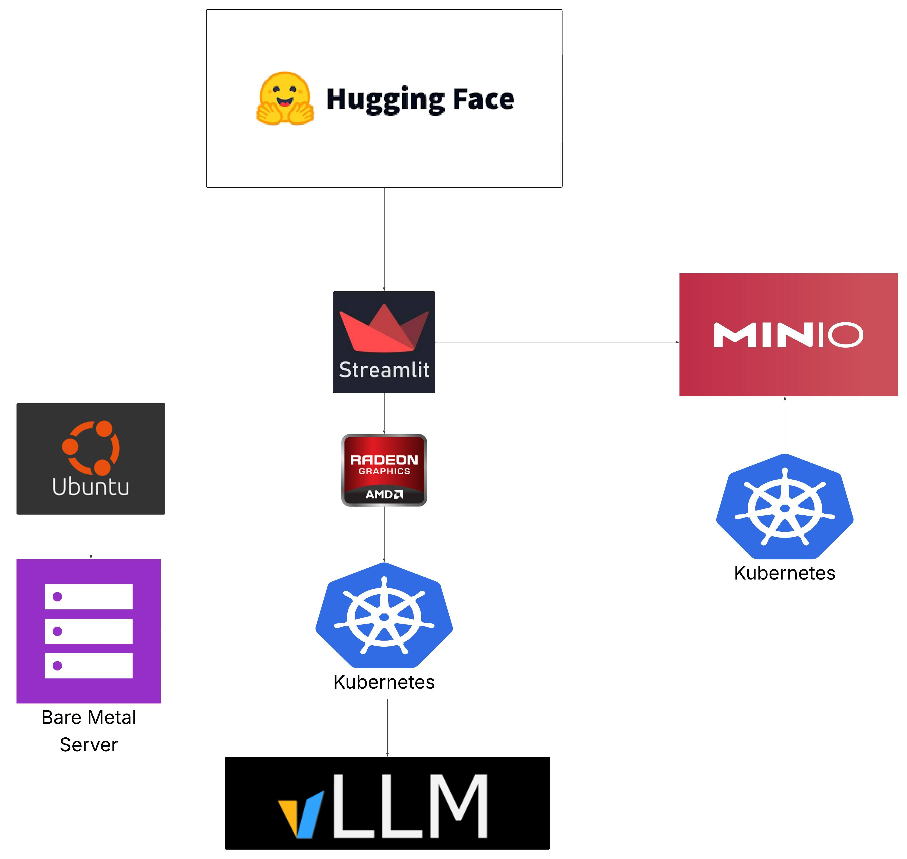

# 🧠 Inference Servers (Radeon + NVIDIA)

Unified documentation for on-prem inference nodes running on **AMD Radeon (ROCm)** and **NVIDIA (CUDA)** GPUs.
Each node runs a **self-contained k3s cluster**, uses **[Argo CD](https://argo-cd.readthedocs.io/en/stable/)** for GitOps, is registered into **[Rancher](https://rancher.com/)** for multi-cluster administration, and deploys a **[Portainer Agent](https://hub.docker.com/r/portainer/agent)** for monitoring and operations.
Model weights are centralized in **[MinIO](https://min.io/)** (on-prem S3), with inference engines pulling from MinIO at runtime.

---

## 🧩 Why Decentralized Inference (Dedicated Hosts)

* **Latency reduction:** Run inference close to apps/users; avoid cloud round-trips.
* **Cost control:** Avoid per-minute GPU billing; dedicated hardware amortizes cost.
* **Data locality & compliance:** Keep sensitive/legal/health data on-prem.
* **Isolation & specialization:** ROCm vs CUDA nodes; no noisy neighbors.
* **Scalability:** Add new nodes modularly; Rancher registers each as a cluster.
* **Fault tolerance:** Node failures are isolated; workloads shift to others.
* **Operational simplicity:** Each node is self-contained with `make install` rebuild.
* **Model flexibility:** Central MinIO repo; nodes selectively load models.
* **Edge/offline use:** Inference without cloud dependency.
* **Separation of concerns:** Training/ETL elsewhere; nodes optimized for serving.

---

## 🎯 Radeon Inference Server (ROCm + vLLM + Open WebUI + Argo)

**Purpose**
A legacy **Radeon GPU** box repurposed as an inference node. It runs **[vLLM ROCm](https://hub.docker.com/r/opea/vllm-rocm)** for LLM inference, with **[Open WebUI](https://github.com/open-webui/open-webui)** as a lightweight evaluation UI.

---

### ✅ Summary & Flow

* **Cluster setup:** Single-node **[k3s](https://k3s.io/)** + local Argo CD instance.
* **GitOps source of truth:** Argo CD syncs this repo’s manifests (`k8s/`) for vLLM, Open WebUI, and Portainer Agent.
* **Repeatable lifecycle:** `make install` (or bootstrap script) → provisions k3s + Argo CD, syncs workloads. `make destroy` → clean teardown.
* **Isolation & scale:** Each model server = independent deployment/service; add multiple vLLM instances for different domains (Legal, Healthcare, Financial, Cyber).
* **Cluster admin:** Registered into **Rancher** for multi-cluster management.
* **Monitoring:** **Portainer Agent** runs on the node for health/ops.
* **Model strategy:**

  * Models are downloaded from **[Hugging Face](https://huggingface.co/models)** into **MinIO** buckets (e.g., `s3://models/legal/usa-bert/`).
  * Inference servers mount or pull weights from MinIO on startup.
  * This decouples storage from compute, avoids bloated containers, and ensures reuse across nodes.

---

### ☁️ Blended Mapping (Radeon ↔ AWS)

| Component (this host) | AWS Equivalent                                                                                                                                   | Notes / Links                                                                                                       |
| --------------------- | ------------------------------------------------------------------------------------------------------------------------------------------------ | ------------------------------------------------------------------------------------------------------------------- |
| **vLLM ROCm**         | [Amazon SageMaker Endpoints](https://docs.aws.amazon.com/sagemaker/latest/dg/realtime-endpoints.html)                                            | On-prem GPU LLM serving. Example: [Mistral-7B-Instruct](https://huggingface.co/mistralai/Mistral-7B-Instruct-v0.3). |
| **Open WebUI**        | [SageMaker JumpStart](https://docs.aws.amazon.com/sagemaker/latest/dg/studio-jumpstart.html) / [Amazon Bedrock](https://aws.amazon.com/bedrock/) | Local vs managed UIs.                                                                                               |
| **Argo CD**           | [EKS GitOps](https://aws-ia.github.io/eks-blueprints-add-ons/) / [CodePipeline](https://docs.aws.amazon.com/codepipeline/)                       | Declarative CD.                                                                                                     |
| **MinIO**             | [Amazon S3](https://docs.aws.amazon.com/s3/)                                                                                                     | Central artifact/model store.                                                                                       |
| **Portainer Agent**   | [CloudWatch Agent](https://docs.aws.amazon.com/AmazonCloudWatch/latest/monitoring/Install-CloudWatch-Agent.html)                                 | Monitoring/ops.                                                                                                     |
| **Rancher**           | [EKS Console](https://docs.aws.amazon.com/eks/latest/userguide/what-is-eks.html)                                                                 | Cluster admin plane.                                                                                                |

---

## 🎯 NVIDIA Inference Server (CUDA + Triton + vLLM + Argo)

**Purpose**
A **NVIDIA GPU** node for LLM and general deep learning workloads. Runs **[NVIDIA Triton Inference Server](https://github.com/triton-inference-server/server)** for multi-model DL serving and/or **[vLLM CUDA](https://vllm.ai/)** for high-throughput LLM inference. **[Open WebUI](https://github.com/open-webui/open-webui)** can be added for testing.

---

### ✅ Summary & Flow

* **Cluster setup:** Single-node **[k3s](https://k3s.io/)**, registered in **Rancher**.
* **GitOps:** **Argo CD** syncs manifests for Triton, vLLM CUDA, Open WebUI, and Portainer Agent.
* **Lifecycle:** `make install`/bootstrap → full setup; `make destroy` → removal.
* **Isolation & scale:** Run Triton (multi-model repo) and vLLM CUDA side by side, scale deployments independently.
* **Cluster admin:** Rancher integrates all clusters into a single view.
* **Monitoring:** Portainer Agent = required monitoring layer on each node.
* **Model strategy:**

  * Models from **[Hugging Face](https://huggingface.co/models)**, **[NVIDIA NGC](https://catalog.ngc.nvidia.com/)**, and others are stored in MinIO.
  * Triton/vLLM pods pull from MinIO at startup.
  * Shared model cache supports reproducibility across deployments.

---

### ☁️ Blended Mapping (NVIDIA ↔ AWS)

| Component (this host)    | AWS Equivalent                                                                                                                                   | Notes / Links                |
| ------------------------ | ------------------------------------------------------------------------------------------------------------------------------------------------ | ---------------------------- |
| **NVIDIA Triton Server** | [SageMaker Multi-Model Endpoints](https://docs.aws.amazon.com/sagemaker/latest/dg/multi-model-endpoints.html)                                    | Multi-framework inference.   |
| **vLLM CUDA**            | [Amazon SageMaker Endpoints](https://docs.aws.amazon.com/sagemaker/latest/dg/realtime-endpoints.html)                                            | High-throughput LLM serving. |
| **Open WebUI**           | [SageMaker JumpStart](https://docs.aws.amazon.com/sagemaker/latest/dg/studio-jumpstart.html) / [Amazon Bedrock](https://aws.amazon.com/bedrock/) | LLM testing UI.              |
| **Argo CD**              | [EKS GitOps](https://aws-ia.github.io/eks-blueprints-add-ons/) / [CodePipeline](https://docs.aws.amazon.com/codepipeline/)                       | Declarative CD.              |
| **MinIO**                | [Amazon S3](https://docs.aws.amazon.com/s3/)                                                                                                     | Centralized storage.         |
| **Portainer Agent**      | [CloudWatch Agent](https://docs.aws.amazon.com/AmazonCloudWatch/latest/monitoring/Install-CloudWatch-Agent.html)                                 | Monitoring/ops.              |
| **Rancher**              | [EKS Console](https://docs.aws.amazon.com/eks/latest/userguide/what-is-eks.html)                                                                 | Cluster admin plane.         |
