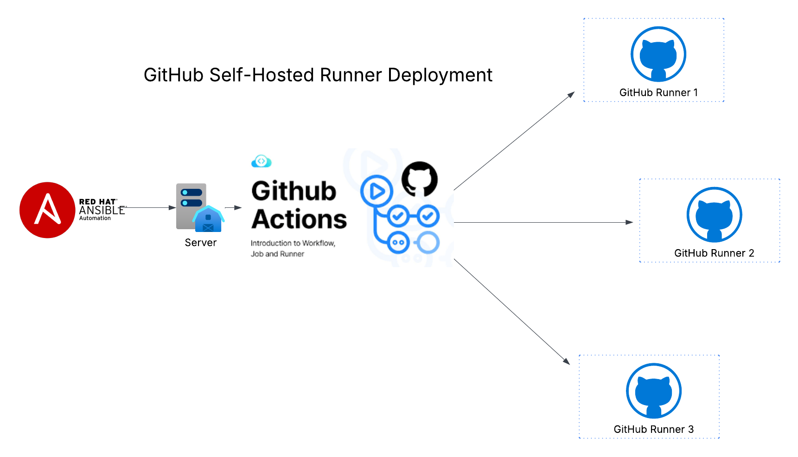

# ⚙️ AI/ML Self-Hosted GitHub Runners

## Summary

Infrastructure-as-code for GPU-optimized, self-hosted [GitHub Actions](https://docs.github.com/actions) runners on bare metal or VMs. Through automated deployment via [Ansible](https://docs.ansible.com/) → Server → GitHub, multiple runners are provisioned in parallel and managed declaratively with GitOps tooling ([Argo CD](https://argo-cd.readthedocs.io/en/stable/) + [Git](https://git-scm.com/)). They execute AI/ML workflow stages locally: pulling/curating models, building and pushing container images, caching Python packages, and deploying inference services to on-prem Kubernetes clusters—enabling parallel AI/ML workflows with low latency, cost efficiency, and horizontal scalability.

<!-- Architecture Diagram -->

---

## ✅ Why Self-Hosted Runners

* **Save cost** vs. cloud-hosted runners (no per-minute billing on GitHub-hosted pool)
* **Full control** over runtime ([CUDA](https://developer.nvidia.com/cuda-zone)/[ROCm](https://rocm.docs.amd.com), [PyTorch](https://pytorch.org/), custom toolchains)
* **Deployable with [Ansible](https://docs.ansible.com/)** → reproducible on bare metal/VMs
* **[Runner groups](https://docs.github.com/enterprise-cloud@latest/actions/hosting-your-own-runners/managing-access-to-self-hosted-runners-using-groups)** enable scheduling & scaling across available resources
* **Parallel workloads**: download/build/deploy multiple models at once
* **Local-first**: inference pipelines run near GPUs, faster than cloud

---

## 📂 Common Workflows

* **Download models** from [Hugging Face](https://huggingface.co/models), [DeepSeek](https://huggingface.co/deepseek-ai), [Mistral](https://huggingface.co/mistralai), [LLaMA](https://ai.meta.com/llama/) and others
* **Store weights** into **[MinIO](https://min.io/)** (on-prem S3) as the single source of truth
* **Build images** with models baked in and push to **[Harbor](https://goharbor.io/)** (OCI registry)
* **Publish packages** to **[DevPI](https://devpi.net/)** / PyPI mirror for reproducibility
* **Deploy inference servers** ([vLLM](https://vllm.ai/), [NVIDIA Triton Inference Server](https://github.com/triton-inference-server/server), [Text Generation Inference (TGI)](https://github.com/huggingface/text-generation-inference)) into **[Kubernetes](https://kubernetes.io/)** clusters via **[Argo CD](https://argo-cd.readthedocs.io/en/stable/)**
* **Scale runners** horizontally to increase model throughput

---

## 🧩 How It Fits

* **[GitHub Actions](https://docs.github.com/actions) → self-hosted runners**: Jobs execute locally instead of GitHub’s cloud pool
* **Runners ↔ [MinIO](https://min.io/)/[Harbor](https://goharbor.io/)/[DevPI](https://devpi.net/)**: Move models and images between storage layers
* **Runners ↔ inference clusters**: Trigger deployments into **[k3s](https://k3s.io/)**/**[Kubernetes](https://kubernetes.io/)** GPU nodes
* **[Argo CD](https://argo-cd.readthedocs.io/en/stable/)**: Keeps inference apps declarative and in sync with **[Git](https://git-scm.com/)** repos

---

## 🔒 Notes

* Tokens and secrets are stored securely in **[Ansible Vault](https://docs.ansible.com/ansible/latest/vault_guide/index.html)** or **[Kubernetes Secrets](https://kubernetes.io/docs/concepts/configuration/secret/)**
* Runners are containerized and isolated, with labels for targeting workflows
* Designed for AI ops, but extensible for generic containerized CI/CD
