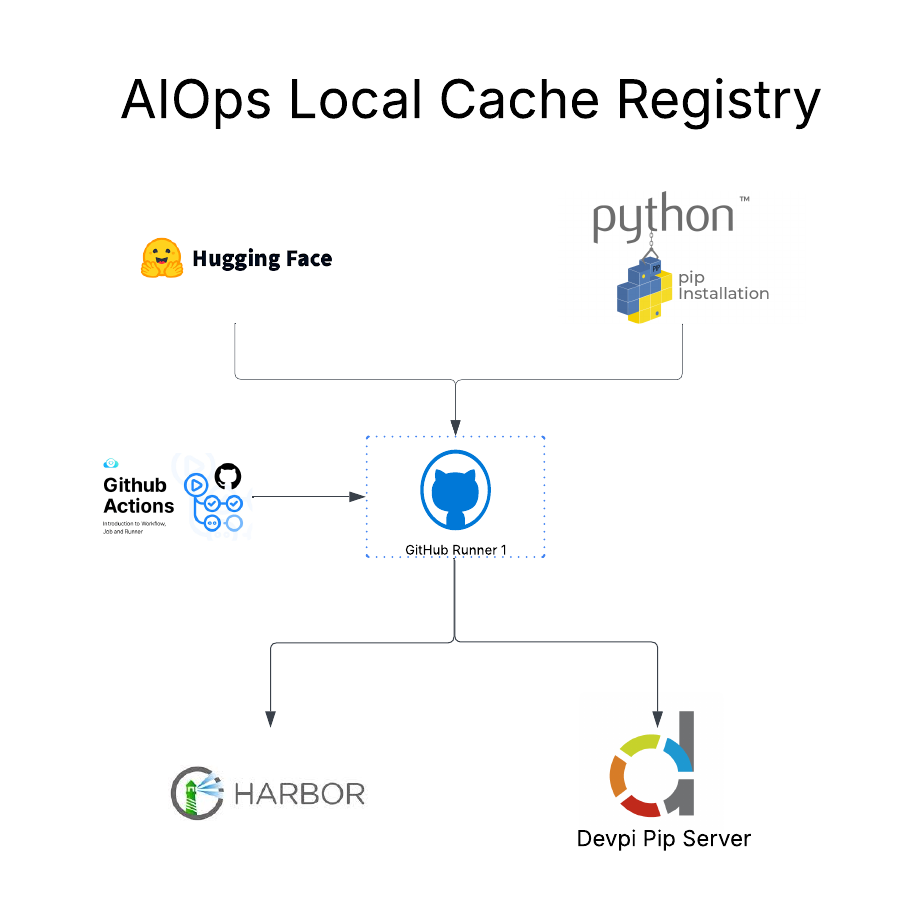

# 🗄️ AIOps Cache Registry (Harbor + DevPI)

## Summary

An on‑premise AI/ML artifact cache that colocates an OCI image registry (Harbor) and a Python package index (DevPI) next to your GPU runners / inference servers. It accelerates builds and deployments by avoiding repeated large downloads, reduces reliance on external services, improves reproducibility and version governance, strengthens security by keeping proprietary models/code internal, and enables continued operation when public registries are slow or unreachable.

---

## ✅ Why a Local Registry?

* **Performance**: Avoid re‑pulling massive images and wheels from the internet
* **Control**: Pin and promote specific versions internally
* **Reproducibility**: Same artifacts across dev/test/prod
* **Security**: Keep sensitive/custom models and code on‑prem
* **Offline‑ready**: Continue operating even if public registries are unreachable

---

## 🧩 Components (with AWS Comparison)

| Local Component                                                             | Role                                                                               | AWS Comparison                                                                                                          |
| --------------------------------------------------------------------------- | ---------------------------------------------------------------------------------- | ----------------------------------------------------------------------------------------------------------------------- |
| **[Harbor](https://goharbor.io/)**                                          | OCI container registry for inference images (e.g., vLLM/TGI with weights baked in) | **[Amazon ECR](https://aws.amazon.com/ecr/)**                                                                           |
| **[DevPI](https://devpi.net/)**                                             | pip/PyPI‑compatible registry for Python wheels and deps                            | **[AWS CodeArtifact](https://aws.amazon.com/codeartifact/)**                                                            |
| **Self‑Hosted Runners** ([GitHub Actions](https://docs.github.com/actions)) | Execute workflows that build/push images and publish wheels                        | **[EC2‑based self‑hosted runners](https://docs.github.com/actions/hosting-your-own-runners/about-self-hosted-runners)** |

### Example AI Images to Host in Harbor

* `vllm-rocm` / `vllm-cuda` with weights pre‑baked
* [`text-generation-inference (TGI)`](https://github.com/huggingface/text-generation-inference) images for domain‑specific serving
* Custom FastAPI + [ONNX Runtime](https://onnxruntime.ai/) inference images

### Example Python Libraries to Cache in DevPI

* [`transformers`](https://pypi.org/project/transformers/)
* [`langchain`](https://pypi.org/project/langchain/)
* [`sentence-transformers`](https://pypi.org/project/sentence-transformers/)
* [`torch`](https://pypi.org/project/torch/)
* [`scikit-learn`](https://pypi.org/project/scikit-learn/)

> Example model reference for images: **[Mistral‑7B‑Instruct v0.3](https://huggingface.co/mistralai/Mistral-7B-Instruct-v0.3)**

---

## 🔁 Workflow (with Self‑Hosted Runners)

1. **[GitHub Actions](https://docs.github.com/actions)** triggers a job on a **self‑hosted runner**
2. Runner downloads models/dependencies (e.g., **[Hugging Face](https://huggingface.co/)**, **[PyPI](https://pypi.org/)**)
3. Runner **builds inference images** → pushes to **[Harbor](https://goharbor.io/)**
4. Runner **packages/caches Python wheels** → pushes to **[DevPI](https://devpi.net/)**
5. Inference servers pull from Harbor/DevPI first; public registries are fallback only

---

## 🧪 Example Activities

* Build and push an image: `harbor.local/ai/vllm-usa-bert:1.0`
* Ensure `pip install transformers` resolves via **DevPI**
* Publish `langchain==0.2.x` wheel to **DevPI** for internal use
* Pull inference images from Harbor instead of Docker Hub

---
