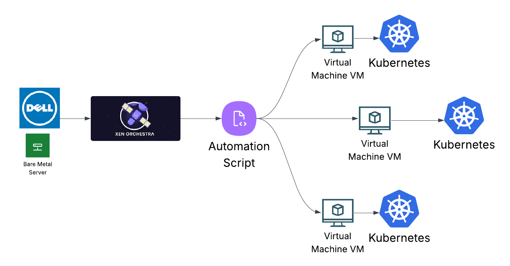

# 🖥️ Cluster Orchestrator (Dell with Xen Orchestrator)

## Purpose in the AI Data Center

The **Dell T440** serves as my **bare‑metal cluster orchestrator**. It runs the **XCP‑ng** hypervisor managed by **Xen Orchestra (XOA)**, and I use **automation scripts** to provision VMs that bootstrap into **Kubernetes clusters** with **Rancher** pre‑installed (ArgoCD removed). This lets me **recreate a cloud‑like environment locally**, mirroring how **Amazon EKS** uses **EC2** worker nodes beneath a managed control plane.

* Amazon EKS overview: [https://docs.aws.amazon.com/eks/latest/userguide/what-is-eks.html](https://docs.aws.amazon.com/eks/latest/userguide/what-is-eks.html)
* EKS compute options (EC2, Managed Node Groups, Fargate): [https://docs.aws.amazon.com/eks/latest/userguide/eks-compute.html](https://docs.aws.amazon.com/eks/latest/userguide/eks-compute.html)

*End‑to‑end flow: Bare‑metal host → XCP‑ng + XOA → automation → VMs → Kubernetes clusters.*

---

## Example Use Cases (moved to top)

* **Legal AI cluster:** OpenSearch + Redis for RAG.
* **Accounting analytics cluster:** ETL + Spark + Iceberg.
* **Healthcare cluster:** EMR modernization and compliance testing.

---

## Why This Matters

* **Cloud simulation:** Recreates the cloud lifecycle — hardware → VMs → clusters → workloads.
* **Repeatable:** Automation deploys, configures, and tears down clusters on demand.
* **Isolated use cases:** Each domain gets its own cluster boundary.
* **Enterprise parity:** Mirrors EKS control‑plane/worker separation using XOA + VM nodes.

---

## How It Works

1. **Bare metal (Dell T440)** — the control foundation.
2. **Xen Orchestra (XOA)** — virtualization fabric for creating/managing VMs.
3. **Automation scripts** — call XOA APIs to create/retire VMs, set networking, and enforce cluster conventions.
4. **Bootstrap VMs** — each comes preconfigured with:

   * **Docker:** [https://www.docker.com/](https://www.docker.com/)
   * **Kubernetes:** [https://kubernetes.io/](https://kubernetes.io/)
   * **Rancher:** centralized multi‑cluster management — [https://rancher.com/](https://rancher.com/)
   * **GitOps Scripts:** Lightweight Helm/kubectl automation (ArgoCD removed)

**Networking at a glance (in this flow):**

* Ensures deterministic **hostnames** and **DNS entries** so nodes join the right cluster.
* Reserves IPs from a known range to avoid conflicts; supports **static** or **DHCP** depending on the template.
* Applies **network segmentation** (e.g., by VLANs/bridges) so clusters don’t bleed into each other.
* Keeps **egress** and **ingress** patterns consistent for GitOps pulls and controller webhooks.

---

## Networking Conventions (quick bullets)

* **Naming:** Hostnames follow a pattern (e.g., `clusterN-nodeM`) for fast identification.
* **Addressing:** Static IPs for control/infra nodes; DHCP acceptable for ephemeral workers.
* **DNS:** Cluster‑scoped zones or prefixes to keep service discovery clean.
* **Segmentation:** Optional VLAN/bridge separation per cluster or environment (dev/test/prod).
* **Egress policy:** GitOps scripts require outbound access to repos; locked down to known destinations.
* **Ingress policy:** Rancher/cluster UIs exposed via controlled endpoints; everything else private by default.
* **Snapshots/Rollback:** Network identity preserved across rollbacks to keep nodes stable.

---

## Why VM Abstraction (vs. only bare metal)

* **Isolation by design:** Each workload/domain gets its own VM set and network identity.
* **Reproducibility:** Golden templates + cloud‑init = identical cluster nodes every time.
* **Lifecycle parity with cloud:** Create/scale/destroy nodes like EC2 Auto Scaling groups.
* **Rollback & snapshots:** Safer testing of upgrades and config changes.
* **Heterogeneous stacks:** Run different OS/versions side‑by‑side without conflicts.
* **GitOps‑friendly:** Rancher + Helm/kubectl automation manage multiple clusters consistently from repos.

---

## What the Automation Handles (no code shown)

* **Provisioning:** From templates/cloud‑init into named VM nodes.
* **Networking setup:** Deterministic hostnames/IPs/DNS so nodes join clusters cleanly.
* **Bootstrap pattern:** Dedicated bootstrap nodes initialize control plane; workers join automatically.
* **Batch rollouts:** Inventory‑driven creation of full clusters for specific use cases.
* **Safe teardown:** Retires clusters cleanly while protecting critical infrastructure VMs.

---

## References (background)

* XCP‑ng: [https://xcp-ng.org/](https://xcp-ng.org/)
* Xen Orchestra: [https://xen-orchestra.com/](https://xen-orchestra.com/)
* Amazon EKS overview: [https://docs.aws.amazon.com/eks/latest/userguide/what-is-eks.html](https://docs.aws.amazon.com/eks/latest/userguide/what-is-eks.html)
* EKS compute: [https://docs.aws.amazon.com/eks/latest/userguide/eks-compute.html](https://docs.aws.amazon.com/eks/latest/userguide/eks-compute.html)
* Rancher: [https://rancher.com/](https://rancher.com/)
* GitOps (scripts + Helm): version-controlled cluster state without ArgoCD
