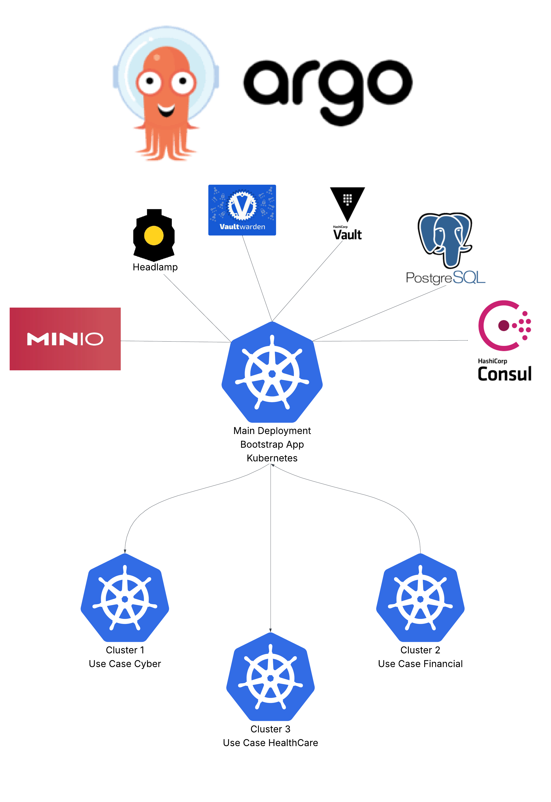

# ⚙️ Kubernetes Cluster Bootstrap — Homelab Edition (K3s + Optional ArgoCD)

> **Internal Reference:**
> This lightweight automation script provisions and verifies a **single-node Kubernetes cluster (K3s)** using Python — with optional integration for **ArgoCD** to manage example apps or workloads.

---

## 🎯 Purpose


Build a **cloud-portable, production-like Kubernetes environment** on local or virtualized hardware.
The automation provisions a **self-contained cluster** with repeatable setup logic — ideal for:

* Testing infrastructure-as-code pipelines
* Running internal workloads and demos
* Practicing multi-cluster orchestration without relying on the cloud

The resulting cluster is **cloud-analogous**, using the same primitives as EKS/AKS/GKE:

* **VM/Node layer:** Self-contaained compute host
* **Kubernetes layer:** K3s (lightweight k8s distribution)
* **Optional GitOps layer:** ArgoCD for declarative app management


---




## 🧩 What’s Deployed

### Core (Always)

| Component                | Description                                          |
| ------------------------ | ---------------------------------------------------- |
| **K3s**                  | Lightweight single-node Kubernetes                   |
| **kubectl**              | CLI access to the cluster                            |
| **Kubeconfig setup**     | Automatically copied to your user’s `~/.kube/config` |
| **/etc/hosts fixup**     | Ensures hostname and primary IP resolution           |
| **Cluster verification** | Confirms node readiness and cluster health           |

### Optional (Example Layer)

| Component        | Purpose                                                                                      |
| ---------------- | -------------------------------------------------------------------------------------------- |
| **ArgoCD**       | *(Optional)* GitOps controller to manage deployments declaratively                           |
| **Example Apps** | *(Optional)* Demo workloads (e.g., MinIO, Vault) that can be added via Argo or Helm manually |

> 🧠 **Tip:** ArgoCD is not installed automatically.
> Use it if you want to manage deployments (like MinIO or Vault) declaratively — simply install ArgoCD on the cluster after bootstrap using Helm or YAML manifests.

---

## ☁️ Cloud Mapping

| Local Component        | Cloud Analogue                           |
| ---------------------- | ---------------------------------------- |
| `bootstrap_cluster.py` | Terraform/CloudFormation bootstrap logic |
| K3s                    | EKS / AKS / GKE cluster runtime          |
| ArgoCD *(optional)*    | Cloud-native GitOps automation           |
| MinIO *(optional)*     | S3 / Azure Blob storage                  |
| Vault *(optional)*     | AWS Secrets Manager / GCP Secret Manager |

---

## 🧠 How It Works

The `bootstrap_cluster.py` script performs the entire cluster setup without a Makefile:

1. **Requires sudo/root** – ensures full system access.
2. **Detects current user** – dynamically sets ownership for kubeconfig.
3. **Ensures /etc/hosts entry** – adds the host IP and hostname if missing.
4. **Installs K3s (server mode)** – disables Traefik by default.
5. **Waits for cluster readiness** – verifies `kubectl get nodes`.
6. **Copies kubeconfig** – to `~/.kube/config` for the invoking user.
7. **Verifies cluster health** – confirms nodes are `Ready`.

---

## 🚀 Quick Start

```bash
sudo python3 bootstrap_cluster.py
```

Example output:

```
[INFO] === K3s Cluster Bootstrap ===
[INFO] Current user : chris
[INFO] Host IP      : 10.0.0.100
[INFO] Installing K3s server (disable traefik)
...
[SUCCESS] All 1/1 nodes Ready.
[SUCCESS] Cluster appears healthy and responsive.
```

---

## 📁 File Structure

| File                         | Purpose                                                          |
| ---------------------------- | ---------------------------------------------------------------- |
| **bootstrap_cluster.py**     | Python-only cluster bootstrap script (no Makefile required)      |
| **templates/bootstrap.yaml** | *(Optional)* base manifest for namespaces or bootstrap resources |
| **assets/**                  | *(Optional)* architecture diagrams and docs                      |

---

## ⚙️ Configuration & Usage Notes

* **Run as root or via sudo.** Script enforces root access for K3s installation.
* **User detection:** The script automatically sets kubeconfig ownership to the invoking non-root user (via `$SUDO_USER`).
* **K3s defaults:** Traefik ingress is disabled by default for lightweight setups.
* **Optional ArgoCD:** If desired, install after bootstrap using Helm:

```bash
kubectl create ns argocd
helm repo add argo https://argoproj.github.io/argo-helm
helm upgrade --install argocd argo/argo-cd -n argocd
```

---

## 🧪 Verification

After bootstrap completes:

```bash
kubectl get nodes
kubectl get pods -A
```

Expected result:

```
NAME      STATUS   ROLES                  AGE   VERSION
node-01   Ready    control-plane,master   1m    v1.30.0+k3s1
```

If nodes are not Ready, check logs with:

```bash
sudo journalctl -u k3s -f
```
**Maintainer:** Internal Homelab / AI Infra Team
**Purpose:** Fast reproducible local Kubernetes provisioning aligned with enterprise-style GitOps workflows.
**Maintainer:** Internal Homelab / AI Infra Team
**Purpose:** Fast reproducible local Kubernetes provisioning aligned with enterprise-style GitOps workflows.
**Purpose:** Fast reproducible local Kubernetes provisioning aligned with enterprise-style GitOps workflows.
